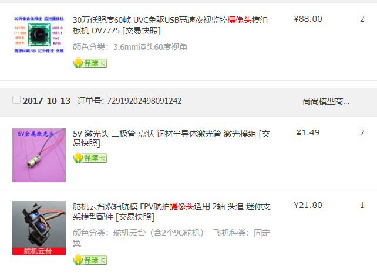
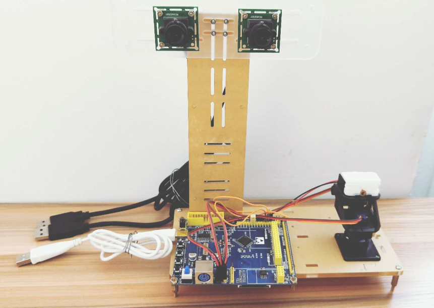

# stereoTracking
双目立体相机目标追踪  
[更多细节参考知乎专栏](https://www.zhihu.com/column/c_144507550)  
## 硬件配置(仅参考)
* 像机、云台、激光器
  
* 支架、标定板  
  [./标定板和支架图](https://github.com/yaodix/stereoTracking/tree/main/%E6%A0%87%E5%AE%9A%E6%9D%BF%E5%92%8C%E6%94%AF%E6%9E%B6%E5%9B%BE)，可自行打印、代加工.
* 运动控制--STM32  
  也可以选择自己熟悉的微控制器

 ### 装配效果图

---------------------------------------
STM32代码丢失(lll￢ω￢)

